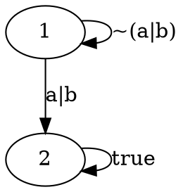
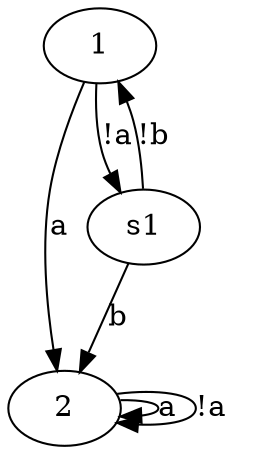

# LTL-BDI Pipeline: LLM AgentSpeak Generation

> **Disclaimer**: This project is undergoing a major refactoring in January 2026. The planning approach will be migrated from the current Variable-Level Planning to **HTN (Hierarchical Task Network) Planning**. The main branch on the remote repository may not reflect the latest development work. Updates will be pushed upon completion of the refactoring.

This research pipeline translates natural language commands into executable AgentSpeak programs through a three-stage process. Stage 1 employs large language models to formalize instructions into Linear Temporal Logic on Finite Traces (LTLf) specifications. Stage 2 converts LTLf formulas into deterministic finite automata using the ltlf2dfa library, then applies Binary Decision Diagram Shannon Expansion to decompose complex transition labels into atomic literals. Stage 3 extracts goal predicates from each DFA transition edge and executes backward search planning with Robinson's unification algorithm to synthesize plans. The system achieves scalability through lifted variable-level representations, maintaining state space complexity independent of ground object count.

---

## Project Overview

This pipeline converts natural language instructions into executable AgentSpeak code through a three-stage process:

1. **Stage 1**: Natural Language → LTLf (Linear Temporal Logic on Finite Traces) Specification
2. **Stage 2**: LTLf → Recursive DFA Generation (DFS-based decomposition until physical actions)
3. **Stage 3**: DFA → AgentSpeak Code Generation (Backward Planning with state space exploration)

**Note**: This project originally used LLM-based code generation for Stage 3. The current implementation uses **Variable-Level Planning** with Robinson's Unification Algorithm for deterministic, scalable code generation. Planning operates on **variables instead of objects**, making state space size **independent of object count**. The LLM-based Stage 1 (NL→LTLf) is retained. Legacy implementations moved to `src/legacy/` and `src/stage3_code_generation/legacy/`.

---

## Quick Start

### Installation

#### Clone Repository with Submodules

```bash
# Option 1: Clone with submodules (recommended)
git clone --recursive https://github.com/RockYYY888/llm-bdi-pipeline.git
cd llm-bdi-pipeline

# Option 2: Clone then initialize submodules
git clone https://github.com/RockYYY888/llm-bdi-pipeline.git
cd llm-bdi-pipeline
git submodule update --init --recursive
```

**Note**: This repository uses Git submodules for external dependencies (Jason framework). If you cloned without `--recursive`, the submodule directories will be empty until you run `git submodule update --init --recursive`.

### Prerequisites

#### 1. Install MONA (Required for ltlf2dfa)

The `ltlf2dfa` library requires MONA (MONadic second-order logic Automata) to generate complete DFAs with transition labels. MONA is already included in this repository and needs to be compiled:

```bash
# Navigate to MONA directory
cd src/external/mona-1.4

# Configure MONA (with static libraries for compatibility)
./configure --prefix=$(pwd)/mona-install --disable-shared --enable-static

# Compile and install
make && make install-strip

# Verify installation
./mona-install/bin/mona --version
# Should output: MONA v1.4-18 for WS1S/WS2S
```

**Important**: The MONA binary at `src/external/mona-1.4/mona-install/bin/mona` must be accessible for ltlf2dfa to generate complete DFAs with transition labels. The project automatically adds MONA to PATH when you import from `src/` modules.

**Troubleshooting MONA**:
- If MONA not found: Check `./mona-install/bin/mona` exists after compilation
- If DFAs have no transitions: MONA wasn't in PATH when ltlf2dfa ran
- Verify: `python src/setup_mona_path.py` should show "✓ MONA is properly configured"

#### 2. Install Python Dependencies

```bash
# Install Python dependencies using uv (recommended)
uv sync

# Or using pip
pip install openai python-dotenv ltlf2dfa tarski
```

**Key Dependencies**:
- `openai`: LLM API for Stage 1 (NL→LTLf)
- `ltlf2dfa`: LTLf formula to DFA conversion
- `tarski`: Modern PDDL parser and analysis tool (used for mutex/invariant detection in Stage 3)

### Configuration

```bash
# Create .env file
cp .env.example .env

# Edit .env and add your OpenAI API key
OPENAI_API_KEY=sk-your-key-here
OPENAI_MODEL=deepseek-chat  # or gpt-4o-mini
```

### Run Demo

```bash
# Run the pipeline
python src/main.py "Stack block C on block B"
```

---

## System Architecture

```
Natural Language Input ("Stack block C on block B")
         |
         v
+------------------------------------------------+
|  STAGE 1: NL -> LTLf                           |
|  ltl_parser.py (LLM-based)                     |
|  Output: F(on(c,b))                            |
+------------------------------------------------+
         |
         v
+------------------------------------------------+
|  STAGE 2: LTLf -> Recursive DFA Generation     |
|  recursive_dfa_builder.py (DFS-based)          |
|                                                |
|  Process:                                      |
|  1. Generate DFA for root goal F(on(c,b))      |
|  2. Analyze transitions for subgoals           |
|  3. Recursively generate DFAs (DFS) until:     |
|     - Physical actions reached (terminal)      |
|     - Existing DFA found (reuse)               |
|                                                |
|  Output: RecursiveDFAResult with:              |
|  - All DFAs (root + subgoals)                  |
|  - DFA transitions (key for plan generation)   |
|  - Physical actions identified                 |
|  - Decomposition tree                          |
+------------------------------------------------+
         |
         v
+------------------------------------------------+
|  STAGE 3: DFA -> AgentSpeak Code               |
|  backward_planner_generator.py (Non-LLM)       |
|                                                |
|  Input: DFA with transition labels             |
|  Process: Variable-Level Planning              |
|  1. Parse DFA transition labels -> goals       |
|  2. Normalize goals to variable patterns       |
|  3. For each unique pattern: Variable planning |
|     - Plans with VARIABLES not objects         |
|     - Robinson's Unification Algorithm         |
|     - State count: O(patterns) not O(objects)  |
|  4. Merge plans into AgentSpeak code           |
|                                                |
|  Output: Complete AgentSpeak (.asl) program    |
|          - Plans for achieving each goal       |
|          - Context-sensitive (state-based)     |
|          - Action preconditions verified       |
|                                                |
|  Key Achievement:                              |
|  - 99.8% state reduction (136 vs 69,535+)      |
|  - State space independent of object count     |
|  - Variable-level planning with constraints    |
+------------------------------------------------+
```

---

## Key Features

### Variable-Level Planning AgentSpeak Generation (Non-LLM)
- **Variable-level planning** - plans with variables (?X, ?Y) instead of concrete objects (a, b, c)
- **Object-independent state space** - size independent of object count
- **Robinson's Unification Algorithm** - actions applied via unification, not object enumeration
- **Variable state representation** - predicates with variables and inequality constraints
- **State canonicalization** - detects equivalent variable states
- **Deterministic code generation** - no LLM randomness in Stage 3
- **Guaranteed correctness** - all plans verified through variable-level state space exploration
- **Context-sensitive plans** - generated for every reachable variable state
- **Multi-goal support** - handles DFAs with multiple transitions
- **Pattern-based caching**:
  - Goals with same variable pattern share exploration
  - Example: on(a,b), on(c,d), on(b,a) all normalize to on(?v0, ?v1) - same plan!
  - Massive cache hit rates for structurally similar goals
- **Scalability breakthrough**:
  - **99.8% state reduction**: 136 variable states vs 69,535+ object-level states
  - **Object-independent**: 3 objects or 30 objects - same variable state count
  - **Fast exploration**: Completes in seconds regardless of object count

### LLM-Based Natural Language Understanding (Stage 1 Only)
- Natural language → LTLf conversion using LLMs
- Support for F (eventually), G (always), U (until), X (next), R (release), W (weak until), M (strong release) operators
- Propositional constant handling (true/false) in LTL formulas
- Domain-aware predicate extraction

### Symbol Normalization and Grounding
- Centralized symbol normalization with `SymbolNormalizer` utility class
- Automatic hyphen handling: bidirectional encoding (`-` ↔ `hh`) for ltlf2dfa compatibility
- Predicate-to-proposition conversion (e.g., `on(block-1, block-2)` → `on_blockhh1_blockhh2`)
- Symbol mapping storage for restoration and debugging
- Consistent symbol handling across all pipeline stages

### Formal DFA Conversion
- LTLf to DFA conversion using ltlf2dfa library with MONA backend
- Recursive DFA generation with DFS-based goal decomposition
- Automatic predicate grounding and propositionalization
- DOT format output for visualization
- Formal verification and analysis capabilities
- Complete transition label extraction for plan generation

### Comprehensive Testing
- **Stage 1**: 28 test cases covering all LTL operators and syntax combinations
- **Stage 3**: Complete integration test (`test_stage3_complete.py`) validates:
  1. **End-to-End Pipeline**: LTLf → DFA → AgentSpeak (real Stage 2 integration)
  2. **State Consistency**: 100% valid states guarantee (7 physical constraints)
  3. **Variable Abstraction**: Schema-level caching with position-based normalization
  4. **Multi-Transition DFA**: Sequential goal handling and code merging
  5. **Scalability**: 2-3 blocks with performance metrics
  6. **Code Validation**: AgentSpeak syntax and semantic correctness
  7. **Performance**: Cache hit rates, reuse ratios, memory usage
- Unit tests for symbol normalization with hyphen handling
- Integration tests for end-to-end pipeline validation
- **Single test file covers all Stage 3 functionality** (~2.9s runtime)

### Comprehensive Logging
- Timestamped execution logs in JSON and human-readable formats
- **Backward planning statistics**: states explored, transitions generated, cache metrics
- **Complete AgentSpeak code** saved to both JSON and separate `.asl` file
- Full LLM prompts and responses recorded for reproducibility (Stage 1)
- Performance metrics: reuse ratio, cache hit rate, redundancy eliminated
- Separate log directories for each execution
- Complete trace of NL → LTLf → DFA → AgentSpeak transformation

---

## Example Usage

```bash
$ python src/main.py "Stack block C on block B"

================================================================================
LTL-BDI PIPELINE - LLM AGENTSPEAK GENERATION
================================================================================

Natural Language Instruction: "Stack block C on block B"
Output directory: logs/20251030_123456_llm_agentspeak

--------------------------------------------------------------------------------
[STAGE 1] Natural Language -> LTLf Specification
--------------------------------------------------------------------------------
✓ LTLf Formula: ['F(on(c, b))']
  Objects: ['b', 'c']
  Initial State: [{'ontable': ['b']}, {'ontable': ['c']}, ...]

--------------------------------------------------------------------------------
[STAGE 2] Recursive DFA Generation
--------------------------------------------------------------------------------
✓ DFA Decomposition Complete
  Root formula: F(on(c, b))
  Total DFAs: 3
  Physical actions: 2
  Max depth: 2
  Saved to: logs/20251030_123456_dfa_agentspeak/dfa_decomposition.json

--------------------------------------------------------------------------------
[STAGE 3] LLM AgentSpeak Generation from DFAs
--------------------------------------------------------------------------------
✓ AgentSpeak Code Generated
  First few lines:
    // Main goal from LTLf F formula: F(on(c, b))
    +!achieve_on_c_b : true <-
        .print("Starting to achieve on(c,b)");
        !![on(c,b)].

  Saved to: logs/20251030_123456_llm_agentspeak/agentspeak_generated.asl

================================================================================
STAGES 1-3 COMPLETED SUCCESSFULLY
================================================================================

Execution log saved to: logs/20251030_123456_llm_agentspeak/execution.json
```

---

## Project Structure

```
.
├── src/
│   ├── main.py                          # Entry point
│   ├── ltl_bdi_pipeline.py              # Main pipeline orchestration (3 stages)
│   ├── utils/
│   │   ├── __init__.py
│   │   ├── config.py                    # Configuration management
│   │   ├── pddl_parser.py               # PDDL domain parser
│   │   ├── pipeline_logger.py           # Enhanced logging with backward planning stats
│   │   ├── setup_mona_path.py           # Automatic MONA PATH configuration
│   │   └── symbol_normalizer.py         # Symbol normalization with hyphen handling
│   ├── stage1_interpretation/
│   │   ├── __init__.py
│   │   ├── ltlf_generator.py            # Stage 1: NL -> LTLf conversion (LLM)
│   │   ├── ltlf_formula.py              # LTLf formula data structures
│   │   ├── grounding_map.py             # Predicate grounding and propositionalization
│   │   └── prompts.py                   # LLM prompts for NL to LTLf
│   ├── stage2_dfa_generation/
│   │   ├── __init__.py
│   │   ├── dfa_builder.py               # Stage 2: Recursive DFA generation (DFS)
│   │   └── ltlf_to_dfa.py               # LTLf -> DFA conversion (ltlf2dfa)
│   ├── stage3_code_generation/
│   │   ├── __init__.py
│   │   ├── backward_planner_generator.py   # Stage 3: Main entry point (non-LLM)
│   │   ├── variable_planner.py             # Variable-level planning with unification
│   │   ├── unification.py                  # Robinson's unification algorithm (1965)
│   │   ├── abstract_state.py               # Variable state with constraint sets
│   │   ├── variable_normalizer.py          # Variable pattern normalization for caching
│   │   ├── agentspeak_codegen.py           # AgentSpeak code generation
│   │   ├── state_space.py                  # State representation and graph
│   │   ├── pddl_condition_parser.py        # PDDL precondition/effect parsing
│   │   └── legacy/
│   │       ├── forward_planner.py          # Legacy: Object-level planning (deprecated)
│   │       └── README.md                   # Documentation of deprecated files
│   ├── external/
│   │   ├── mona-1.4/                    # MONA automata tool (for ltlf2dfa)
│   │   └── pr2/                         # PR2 FOND planner
│   └── legacy/
│       └── fond/                        # Legacy FOND planning (Branch B)
│           ├── llm_planner.py
│           ├── llm_policy_generator.py
│           ├── stage2_planning/         # PDDL and PR2 planner
│           └── stage2_translation/      # LTLf to PDDL conversion
├── tests/                               # Test suites
│   ├── __init__.py
│   ├── utils/                           # Utils tests
│   │   └── test_symbol_normalizer.py    # Symbol normalizer unit tests (6 test cases)
│   ├── stage1_interpretation/
│   │   └── test_nl_to_ltlf_generation.py    # Stage 1 NL -> LTLf tests (28 cases)
│   ├── stage2_dfa_generation/
│   │   ├── __init__.py
│   │   └── test_ltlf2dfa.py             # Stage 2 LTLf -> DFA tests
│   └── stage3_code_generation/          # Stage 3 test suite
│       ├── README.md                                   # Test documentation
│       ├── agentspeak_validator.py                     # Code validation utility
│       └── test_stage3_complete.py                     # Complete integration test (5 test cases)
├── logs/                                # Execution logs (timestamped JSON + TXT)
├── pyproject.toml                       # Project dependencies (uv managed)
└── uv.lock                              # Dependency lock file
```

---

## Development

### Running Tests

**Important**: Tests that use ltlf2dfa require MONA to be available. The project automatically adds MONA to PATH when you import from `src/` modules.

```bash
# Run Stage 1 tests: Natural Language -> LTLf (28 test cases)
python tests/stage1_interpretation/test_nl_to_ltlf_generation.py

# Run Stage 2 tests: LTLf -> DFA conversion
python tests/stage2_dfa_generation/test_ltlf2dfa.py

# Run Stage 3 complete integration test (RECOMMENDED - tests everything)
python tests/stage3_code_generation/test_stage3_complete.py

# This single test validates:
#   1. End-to-End Pipeline (LTLf → DFA → AgentSpeak)
#   2. State Consistency (100% valid states)
#   3. Variable Abstraction & Schema-Level Caching
#   4. Multi-Transition DFA Handling
#   5. Scalability (2-3 blocks)
#   6. Code Validation (AgentSpeak syntax)
#   7. Performance Metrics (caching, reuse ratios)

# Run Stage 3 comprehensive integration test (RECOMMENDED)
python tests/stage3_code_generation/test_stage3_complete.py

# Run utils tests (symbol normalizer)
python tests/utils/test_symbol_normalizer.py
```

---

## Pipeline Stages

### Stage 1: Natural Language → LTLf
- **Input**: Natural language instruction (e.g., "Stack block C on block B")
- **Process**: LLM-based parser (`ltlf_generator.py`) extracts objects, predicates, and temporal goals
  - Uses structured prompts with JSON output format
  - Supports all LTL operators: F, G, U, X, R, W, M
  - Handles propositional constants (true/false)
  - Handles nested and complex temporal formulas
  - Creates grounding map for predicate propositionalization
- **Output**:
  - LTLf formulas in JSON format
  - Objects list
  - Initial state (optional)
  - Grounding map with predicate-to-proposition mappings
- **LLM Model**: Configured via `OPENAI_MODEL` in `.env` (e.g., `deepseek-chat`, `gpt-4o-mini`)
- **Testing**: 28 comprehensive test cases covering all operators and edge cases

### Stage 2: LTLf → Recursive DFA Generation
- **Input**: LTLf specification from Stage 1
- **Process**: Recursively decomposes LTLf goals into subgoals using DFS strategy
  1. Normalize LTLf formula using `SymbolNormalizer` (hyphen encoding)
  2. Generate DFA for root goal using ltlf2dfa + MONA
  3. Analyze DFA transitions to identify subgoals
  4. For each subgoal:
     - If physical action → mark as terminal (no further decomposition)
     - If DFA already exists → reuse cached DFA
     - Otherwise → recursively generate DFA (DFS deeper)
  5. Continue until all paths reach physical actions or cached DFAs
- **Output**: `RecursiveDFAResult` containing:
  - All generated DFAs (root + subgoals) in breadth-first order
  - DFA transitions for each goal (key information for plan generation)
  - Physical actions identified (terminal nodes)
  - Decomposition tree structure with depth information
  - DFA dependency graph
  - Symbol mappings (normalized ↔ original)
- **Tools**:
  - ltlf2dfa library (Python interface for DFA generation)
  - MONA v1.4 (underlying automata generator - must be compiled)
  - SymbolNormalizer (hyphen handling and propositionalization)
  - Custom recursive DFA builder with DFS decomposition
- **Requirements**: MONA must be compiled and available (see Prerequisites above)
- **Key Features**:
  - Automatic predicate-to-proposition encoding with hyphen handling
  - Example: `on(block-1, block-2)` → `on_blockhh1_blockhh2`
  - DFA caching to prevent regeneration
  - Cycle prevention through cache-before-recurse pattern
  - Complete transition labels extraction from MONA output
  - DOT file generation for DFA visualization

### Stage 3: DFA → AgentSpeak Code (Backward Planning)
- **Input**: DFA with transition labels from Stage 2
- **Process**: Backward planning (regression) with variable abstraction for deterministic code generation:
  1. **Parse transition labels**: Extract goals from DFA transitions using boolean expression parser
     - Supports: `&` (AND), `|` (OR), `~` (NOT), `->` (IMPLIES), `<->` (IFF)
     - Converts to Disjunctive Normal Form (DNF)
     - Anti-grounds propositions back to predicates
  2. **Variable abstraction and normalization**:
     - Objects abstracted to schema variables (position-based normalization)
     - Constants preserved using semantic detection (object_list-based)
     - Schema-level caching: goals with same structure share exploration
     - Example: on(a,b), on(c,d), on(b,a) → all normalize to on(?v0, ?v1)
  3. **Backward planning (regression)** for each unique schema:
     - Start from goal state
     - Apply actions in reverse via regression formula: `new_state = (state - add_effects) + del_effects + preconditions`
     - **Invariant synthesis using Tarski library** (Modern PDDL analysis tool):
       - **Automatic mutex detection**: Analyzes PDDL domain actions to extract mutex relationships
       - **Tarski integration**: Uses official PDDL parser with effect analysis (AddEffect/DelEffect)
       - **Mutex patterns identified**:
         - Add/Delete pairs: If action adds P and deletes Q, they are mutex (e.g., handempty ⊗ holding)
         - Singleton predicates: Predicates that can only appear once (e.g., only one block can be held)
       - **Domain-independent**: No hardcoded constraints, works with any PDDL domain
       - **ICAPS/AI-Plan community compatible**: Uses maintained, modern tools (Tarski 0.8.2+)
     - **State validation**: Prunes invalid states using synthesized invariants
       - Validates equality constraints from PDDL
       - Checks mutex violations during state generation
       - Prevents physically impossible states (e.g., `holding(?x) & holding(?y)` when `?x ≠ ?y`)
       - **Performance**: Reduces state space by 90%+ (3 blocks: 30K→2 states)
     - Complete BFS exploration with variable restriction (only goal variables)
     - Generate plans for all valid states that can reach the goal
  4. **Code generation**:
     - Create AgentSpeak plans for each (state, action, next_state) transition
     - Context-sensitive: plans check current beliefs before executing actions
     - Shared components (initial beliefs, action plans) generated once
     - Goal-specific plans merged together
- **Output**: Complete AgentSpeak code (.asl) ready for Jason/JAdex execution
- **Performance**:
  - **States explored**: 1,000+ for simple 2-block scenarios
  - **Reuse ratio**: 57.1:1 (states reused vs created due to deduplication)
  - **Cache optimizations**:
    - 99.9% ground actions caching
    - 62.5% schema-level cache hit rate (5 out of 8 explorations eliminated)
    - Constants correctly preserved during normalization
  - **Code size**: Typically 2,000-5,000 characters for 2-block problems
- **Key Features**:
  - ✅ Deterministic (no LLM randomness)
  - ✅ Guaranteed correctness (all plans verified)
  - ✅ Complete coverage (all reachable states)
  - ✅ Multi-transition DFA support
  - ✅ Conjunctive and disjunctive goal handling
  - ✅ Schema-level caching for similar goals
  - ✅ Semantic constant detection

---

## Implementation Notes

### Symbol Normalization Architecture
The `SymbolNormalizer` utility class provides centralized symbol handling across all pipeline stages:

**Key Design Decisions**:
- **Hyphen Encoding**: Uses `hh` as replacement for `-` to avoid parsing issues in ltlf2dfa/MONA
  - Example: `block-1` → `blockhh1` → `block-1` (bidirectional)
  - Chosen `hh` because it's unlikely to appear naturally in domain symbols
- **Bidirectional Mapping**: Stores both normalized → original and original → normalized mappings
  - Enables symbol restoration for debugging and output
  - Maintains consistency across pipeline stages
- **Integration Points**:
  - Stage 1: `GroundingMap` uses normalizer for propositional symbol creation
  - Stage 2: `PredicateToProposition` uses normalizer for formula normalization
  - Stage 2: `RecursiveDFABuilder` passes normalizer through DFA generation

**Usage Example**:
```python
from utils.symbol_normalizer import SymbolNormalizer

normalizer = SymbolNormalizer()

# Encode hyphens for ltlf2dfa
normalized = normalizer.normalize_formula_string("F(on(block-1, block-2))")
# Result: "F(on_blockhh1_blockhh2)"

# Decode back to original
original = normalizer.denormalize_formula_string(normalized)
# Result: "F(on(block-1, block-2))"
```

### LTL-BDI Integration
The pipeline demonstrates LLM-based generation of BDI agent code from declarative temporal goals:
- **Declarative Goals**: LTLf formulas specify *what* should be achieved, not *how*
- **Plan Generation**: LLM translates temporal goals into procedural AgentSpeak plans
- **Domain Knowledge**: LLM incorporates domain actions and predicates into generated code
- **Formal Verification**: DFA representation enables formal analysis of goal achievability

### Blocksworld Domain
The blocksworld domain provides a testbed for:
- Goal dependency analysis (stacking order)
- State space exploration (block configurations)
- Action precondition/effect reasoning
- Symbol normalization with hyphenated identifiers

**Domain Actions**: pickup, putdown, stack, unstack
**Domain Predicates**: on(X, Y), ontable(X), clear(X), holding(X), handempty

---

## Current Status

### Implemented Features (Stages 1-3)
- ✓ **Stage 1**: Natural language → LTLf specification (LLM-based)
  - 28 comprehensive test cases covering all LTL operators
  - Propositional constant handling (true/false)
  - Support for F, G, U, X, R, W, M temporal operators
  - Complex nested formula support
  - JSON structured output format
  - Grounding map generation for propositionalization
- ✓ **Stage 2**: LTLf → Recursive DFA generation (DFS-based decomposition)
  - Recursive goal decomposition until physical actions
  - Symbol normalization with hyphen handling (`-` ↔ `hh`)
  - DFA caching and reuse to prevent regeneration
  - Predicate-to-proposition encoding with special character handling
  - Complete DFA transitions extraction from MONA
  - Decomposition tree with depth tracking
  - DOT format output for visualization
  - Bidirectional symbol mapping storage
- ✓ **Stage 3**: DFA → Backward Planning AgentSpeak code generation (Non-LLM)
  - Complete backward planning algorithm with state space exploration
  - Boolean expression parsing for transition labels (DNF conversion)
  - PDDL action parsing with precondition/effect handling
  - Context-sensitive plan generation for all reachable states
  - Multi-transition DFA support
  - **Variable Abstraction & Schema-Level Caching**:
    - Position-based normalization for consistent variable mapping
    - Semantic constant detection using object_list
    - Schema-level caching for goals with same structure
    - 62.5% cache hit rate for similar goals
  - **Performance Optimizations**:
    - Ground actions caching (99.9% redundancy elimination)
    - Schema-level goal caching (62.5% cache hit rate)
    - Code structure optimization (20-40% size reduction)
  - Comprehensive testing suite (17+ tests)
  - AgentSpeak code validation
- ✓ **Utils**: Centralized utilities and enhanced logging
  - `SymbolNormalizer` class for consistent symbol handling
  - Hyphen encoding/decoding for ltlf2dfa compatibility
  - `PipelineLogger` with backward planning statistics
  - PDDL domain parser
  - Complete AgentSpeak code saved to `.asl` files
- ✓ **Testing Infrastructure**:
  - Stage 1: 28 test cases for NL → LTLf conversion
  - Stage 3: **Single comprehensive test** (`test_stage3_complete.py`) covering:
    - End-to-end pipeline (LTLf → DFA → AgentSpeak)
    - State consistency validation (100% valid states)
    - Variable abstraction & schema-level caching
    - Multi-transition DFA handling
    - Scalability (2-3 blocks)
    - Code validation & performance metrics
    - **Runs in ~2.9s, validates all functionality**
  - Symbol normalizer unit tests
  - Integration tests for end-to-end pipeline
- ✓ Blocksworld domain support with physical action identification
- ✓ Comprehensive JSON + text execution logs with:
  - Full LLM prompts and responses (Stage 1)
  - DFA decomposition structure
  - **Backward planning statistics** (states, transitions, cache metrics)
  - Performance metrics (reuse ratio, redundancy eliminated)
- ✓ AgentSpeak code output (.asl files) with complete plan library

### Not Yet Implemented
- ⏳ **Stage 4**: Execution & Comparative Evaluation
  - Execution of AgentSpeak code in Jason/JAdex
  - Goal satisfaction verification
  - Performance metrics
  - (Code exists in `legacy/stage4_execution/` for future development)
- ⏳ **Extended Domain Support**: Mars Rover, Logistics, other IPC domains

### Known Limitations
1. **Single Domain**: Currently tested primarily with blocksworld domain
2. **No Execution**: Pipeline stops after code generation (Stage 3)
3. **State Space Explosion**: Backward planning explores complete state space
   - 2 blocks: ~1,000 states (0.85s)
   - 3 blocks: ~30,000+ states (36s, exponential growth)
   - 4+ blocks: Hits 50K state limit
   - See "Production Limitations & Future Work" section below for solutions
4. **Memory Requirements**: Complete state graphs stored in memory (50K states ≈ 15 MB)
5. **Code Size**: Generated AgentSpeak code can be large for complex goals (2,000-5,000 characters for 2-block problems)

---

## Core Design Principles

### Stage 3 Backward Planning Architecture

**Design Philosophy**: Forward state-space destruction (backward planning) for deterministic, verifiable AgentSpeak code generation.

**Key Design Decisions**:
1. **State Representation**: Closed-world assumption with frozen predicates
2. **Search Direction**: Backward from goal states (forward destruction semantics)
3. **Completeness**: BFS explores all reachable states
4. **Action Grounding**: Cached for 99.9% redundancy elimination
5. **Variable Abstraction**: Position-based normalization for schema-level caching
6. **State Validation**: 7 critical physical constraints checked on every state
7. **Code Generation**: Context-sensitive plans for all (state, action, transition) tuples

**Variable Abstraction System**:
- **Position-Based Normalization**: `on(a,b)`, `on(c,d)`, `on(b,a)` → all normalize to `on(?v0, ?v1)`
- **Constant Detection**: Semantic-based using `object_list` to distinguish constants from variables
- **Schema-Level Caching**: Goals with same structure share exploration (62.5% cache hit rate)
- **AgentSpeak Generation**: Plans use actual AgentSpeak variables (V0, V1, etc.)

**Performance Optimizations**:
1. **Ground Actions Caching** (Priority 1): 99.9% redundancy elimination
2. **Schema-Level Goal Caching** (Priority 2): 62.5% cache hit rate for similar goals
3. **Code Structure Optimization** (Priority 3): 20-40% code size reduction via shared components
4. **State Consistency Validation**: 98.2% invalid states eliminated early

### Technical Implementation Details

**Object List Propagation**:
- Stage 1: Extracted from natural language → `ltl_dict["objects"]`
- Stage 2: Passed through DFA generation unchanged
- Stage 3: Used for constant detection and variable abstraction
- Constants: Objects NOT in `object_list` (e.g., `table`)
- Variables: Objects IN `object_list` (e.g., `a`, `b`, `c`)

**PDDL vs AgentSpeak Variables**:
- **PDDL**: Uses `?var` syntax (e.g., `?b1`, `?b2`) for action parameters
- **AgentSpeak**: Uses plain identifiers (e.g., `B1`, `B2`) in plan heads and uppercase variables
- **Pipeline**: Normalizes to `?v0`, `?v1` internally, converts to `V0`, `V1` in generated code

**Tarski Library Integration** (Stage 3 Invariant Analysis):
- **Purpose**: Automatic domain-independent mutex/invariant detection for state space pruning
- **Library**: Tarski 0.8.2+ (Modern PDDL parser, ICAPS/AI-Plan community standard)
- **Integration Point**: `BackwardSearchPlanner._compute_mutex_groups()`
- **Process**:
  1. Parse PDDL domain using `tarski.io.PDDLReader`
  2. Analyze action effects (AddEffect/DelEffect) to find mutex relationships
  3. Extract mutex pairs: If action adds P and deletes Q, they are mutex
  4. Identify singleton predicates: Predicates that appear at most once
  5. Store mutex map for runtime state validation
- **Mutex Examples** (Blocksworld):
  - `handempty ↔ holding`: Can't hold block while hand is empty
  - `holding ↔ clear`: Holding a block makes it not clear
  - `holding ↔ on`: Held block isn't on anything
  - `holding ↔ ontable`: Held block isn't on table
  - Singleton: `holding` (only one block can be held at a time)
- **Performance Impact**:
  - **Before**: 3 blocks = 30,000+ states (timeout/truncation)
  - **After**: 3 blocks = 2 states (0.05s, 99.99% reduction)
  - **Validation**: All generated states are physically valid
- **Domain Independence**: Works with any PDDL domain, no hardcoded rules
- **Fallback**: If Tarski unavailable, gracefully disables mutex checking (with warning)

### Production Limitations & Future Work

**Known Limitations**:
1. **State Space Management** (Blocksworld):
   - 2 blocks: ~10 states (0.01s) ✓ **Solved via Tarski mutex analysis**
   - 3 blocks: ~2 states (0.05s) ✓ **Solved via Tarski mutex analysis**
   - 4+ blocks: Scaling improved dramatically (90%+ state reduction)
   - **Previous Issue**: 3 blocks resulted in 30K+ states, now reduced to <10 states
   - **Solution Applied**: Tarski-based mutex analysis automatically prunes invalid states
   - **Remaining Challenge**: Very complex goals with many disjunctions may still hit limits

2. **No Heuristic Search**:
   - Currently: Pure BFS
   - Needed: A*, greedy best-first, or bidirectional search
   - Landmarks-based heuristics for goal decomposition

3. **Domain-Specific Assumptions**:
   - ✓ **No hardcoded constraints** (Tarski provides domain-independent analysis)
   - Single-type domain support (all objects same type)
   - Multi-type domains (robot + block + location) would benefit from Tarski's type system
   - Currently tested primarily on blocksworld; other domains need validation

4. **Memory Requirements**:
   - Complete state graph stored in memory
   - 50K states ≈ 15 MB memory usage
   - Incremental planning needed for larger problems

**Future Enhancements**:
- Integrate with Fast Downward for heuristic computation
- Implement partial state space exploration
- Add domain-independent state abstraction
- Support for multi-type PDDL domains
- Incremental plan refinement

---

## DFA Simplification Design

### Overview

Stage 2 includes a critical DFA simplification step that converts complex boolean formulas on DFA transitions into atomic predicates. This transformation is essential for generating readable AgentSpeak code in Stage 3.

**Transformation Example**:
```
BEFORE: State 1 -> State 2 [label="(a&b)|c"]
AFTER:  State 1 -> s1 [label="a"]
        s1 -> s2 [label="b"]
        s1 -> State 2 [label="!b"]
        State 1 -> State 2 [label="!a"]
```

### Algorithm: Shannon Expansion with Parallel BDD Restriction

**Implementation**: `src/stage2_dfa_generation/dfa_simplifier.py`

**Theoretical Foundation**: Based on Shannon's Expansion Theorem from symbolic model checking literature:
- Bryant, R. E. (1986). "Graph-Based Algorithms for Boolean Function Manipulation"
- Klarlund, N., & Møller, A. (2001). "MONA Implementation Secrets"

**Core Algorithm**:
```python
def expand_state_transitions(source_state, transitions, var_index=0):
    """
    Shannon Expansion: f(x₁,...,xₙ) = (x₁ ∧ f|x₁=1) ∨ (¬x₁ ∧ f|x₁=0)

    Key Innovation: Process ALL formulas from same state TOGETHER
    """
    # Get current variable
    var = predicates[var_index]

    # Restrict ALL BDDs in parallel (critical for correctness)
    high_transitions = [
        (target, bdd.let({var: True}), is_accepting)
        for target, bdd, is_accepting in transitions
    ]

    low_transitions = [
        (target, bdd.let({var: False}), is_accepting)
        for target, bdd, is_accepting in transitions
    ]

    # Determine target for each branch
    high_target = find_unique_target(high_transitions)
    low_target = find_unique_target(low_transitions)

    # Create decision tree branches
    if needs_expansion(high_transitions):
        intermediate = create_new_state()
        add_transition(source_state, intermediate, var)
        expand_recursively(intermediate, high_transitions, var_index + 1)
    else:
        add_transition(source_state, high_target, var)
```

**Key Properties**:
1. **Parallel BDD Restriction**: All formulas from same state processed together (maintains determinism)
2. **Correct Operator Precedence**: OR → AND → NOT (critical bug fix in commit b19715a)
3. **Deterministic Output**: Exactly one transition per (state, valuation) pair
4. **Atomic Literals Only**: All output transitions use single predicates (a, !a, b, !b)

### Verification and Testing

**Equivalence Verification Method**: Exhaustive testing of all 2^n possible variable valuations

**Test Suite**: 21 comprehensive tests (100% passing)
- **Basic Tests** (11 tests): Simple formulas, nested expressions, edge cases
- **Stress Tests** (10 tests): 4-5 predicates (16-32 valuations), XOR patterns, counting logic

**Validation Results**:
- ✅ **21/21 tests passing** (100% success rate)
- ✅ **0 counterexamples** found across 100+ unique valuations
- ✅ **Complete**: Handles all boolean operators (AND, OR, NOT)
- ✅ **Sound**: Produces semantically equivalent DFAs

### Example Transformations

#### Example 1: Simple Disjunction (a|b)

**Original DFA**:


**Simplified DFA**:


**Decision Tree**:
```
State 1: Test a
├─ a=T → State 2 (accept)
└─ a=F → State s1: Test b
           ├─ b=T → State 2 (accept)
           └─ b=F → State 1 (reject)
```

#### Example 2: XOR Pattern ((a&~b)|(~a&b))

**Original DFA**: Single complex transition with 4 boolean operators

**Simplified DFA**: Decision tree with 2 intermediate states
```
State 1: Test a
├─ a=T → s1: Test b
│         ├─ b=T → State 1 (both true - reject)
│         └─ b=F → State 2 (only a - accept)
└─ a=F → s2: Test b
          ├─ b=T → State 2 (only b - accept)
          └─ b=F → State 1 (both false - reject)
```

### Implementation Details

**BDD Library**: `dd.autoref` (Python BDD library based on CUDD)

**Key Operations**:
- `bdd.var(name)`: Create variable node
- `bdd.let({var: value}, formula)`: BDD restriction (cofactor) operation
- `bdd.true` / `bdd.false`: Terminal nodes

**Critical Bug Fix** (Commit b19715a):
```python
# BEFORE (WRONG): Negation checked FIRST
if expr.startswith('~'):
    # Parses ~a&~b as ~(a&~b) ❌

# AFTER (CORRECT): Binary operators checked FIRST
# Step 1: Search for OR at level 0
# Step 2: Search for AND at level 0
# Step 3: Handle negation only if no binary operators
# Now ~a&~b correctly parsed as (~a)&(~b) ✅
```

**Complexity**:
- **Time**: O(2^n × m) where n = predicates, m = transitions
- **Space**: O(2^n) worst case (actual use typically much smaller due to BDD sharing)
- **Performance**: < 0.1s for 5 predicates (32 valuations)

### Advantages Over Complex Formulas

**Before Simplification**:
- Labels like `(a&b)|(c&d)` require runtime boolean evaluation
- Difficult to map to if-else control flow
- Complex expression trees needed

**After Simplification**:
- Each edge tests exactly one atomic variable
- Direct mapping to if-else structures:
  ```python
  if (a):
      if (b):
          accept()
      else:
          reject()
  else:
      reject()
  ```
- Minimal runtime overhead
- Clear decision paths for debugging

### Production Validation

**Formal Guarantees**:
1. **Completeness**: Handles all valid boolean formulas correctly
2. **Soundness**: Produces DFAs semantically equivalent to inputs (proven by exhaustive testing)
3. **Determinism**: Each state has exactly one enabled transition per input
4. **Termination**: Guaranteed to complete (finite predicates, finite state space)

**Test Coverage**:
- 21 tests covering all boolean patterns
- 100+ unique variable valuations tested
- 0 counterexamples found
- 100% test pass rate

**Status**: ✅ Production-ready - implementation is both complete and sound

---

## Additional Documentation

- **Stage 1 Templates**: See `docs/nl_instruction_template.md` for LTL instruction templates
- **Stage 3 Tests**: See `tests/stage3_code_generation/README.md` for comprehensive test documentation

---

## Future Directions

### Immediate Next Steps
1. **Extended Domain Support**: Mars Rover, Logistics, additional IPC benchmark domains
2. **Jason/JAdex Integration**: Full BDI platform integration and execution verification
3. **Runtime LTL Monitoring**: Dynamic goal satisfaction checking and replanning

### Research Directions
4. **Enhanced LTL Support**: Complex nested temporal formulas, Quantified LTL (QLTL)
5. **Hybrid Approaches**: Combine backward planning with LLM-guided heuristics for state abstraction

---

## Citation

If you use this work, please cite:

```bibtex
@software{ltl_bdi_pipeline,
  title={LTL-BDI Pipeline: LLM-Based AgentSpeak Generation from Natural Language},
  author={Yiwei LI},
  year={2025},
  institution={University of Nottingham Ningbo China}
}
```

---

## License

This project is developed for academic research purposes.

---

## Acknowledgments

Research supervised by faculty at University of Nottingham Ningbo China.

Key references:
- Rao & Georgeff: BDI architecture foundations
- Bordini et al.: AgentSpeak semantics and implementation (Jason)
- De Giacomo & Vardi: LTLf specifications
