# LTL-Based LLM-BDI Pipeline

**Linear Temporal Logic Integration for Intelligent Agent Planning**

---

## 🚀 Quick Start

Get the LTL pipeline running in 2 minutes.

### Installation

```bash
# Install uv if needed
curl -LsSf https://astral.sh/uv/install.sh | sh

# Install dependencies
cd llm-bdi-pipeline
uv sync
```

### Use with LLM

```bash
# Configure API key
cp .env.example .env
# Edit .env: OPENAI_API_KEY=your-key-here
```

### Run Your First Test

```bash
uv run python src/main.py "Put block A on block B"
```

**Expected Output**:
```
Stage 1: Natural Language → LTL
  Objects: ['a', 'b']
  LTL Formulas:
    1. F(on(a, b))      # Eventually a is on b
    2. F(clear(a))      # Eventually a is clear

Stage 2: LTL → PDDL Problem
  Generated: output/20251022_170921/problem.pddl

Stage 3: PDDL → Action Plan
  Plan:
    1. pickup(a)
    2. stack(a, b)

✓ Pipeline Complete
```

**What Happened**:
1. Natural Language → LTL formulas (`F(on(a,b))`)
2. LTL → PDDL problem file
3. PDDL → Action plan (`pickup(a)`, `stack(a,b)`)

Check `output/YYYYMMDD_HHMMSS/` for generated files.

---

## Table of Contents

- [Quick Start](#-quick-start) *(Installation & First Test)*
- [Overview](#overview)
- [Quick Example](#quick-example)
- [Architecture](#architecture)
- [LTL Operators](#ltl-operators)
- [Usage Examples](#usage-examples)
- [Output Files](#output-files)
- [Configuration](#configuration)
- [Advanced Usage](#advanced-usage)
- [Troubleshooting](#troubleshooting)
- [Version History](#version-history)
- [Research Context](#research-context)

---

## Overview

A three-stage pipeline that converts natural language instructions into executable action plans using **Linear Temporal Logic (LTL)** for temporal goal specification.

```
Natural Language → LTL Specification → PDDL Problem → Action Plan
```

**Key Innovation**: Uses LTL temporal operators (F, G) instead of simple state-based goals, enabling expressive temporal requirements like "eventually achieve X while always maintaining Y".

### What is LTL?

**Linear Temporal Logic** is a formal language for specifying properties about sequences of states over time.

**Simple analogy**:
- **Without LTL**: "The prince saved the princess" (single fact, no time)
- **With LTL**: "The prince will eventually save the princess" (temporal property)

**Why LTL for BDI agents?**
- ✅ Express temporal requirements: "eventually X", "always Y", "X until Y"
- ✅ Formal verification: LTL formulas can be verified and monitored
- ✅ Natural mapping: LTL goals map cleanly to PDDL planning problems

---

## Quick Example

```bash
uv run python src/main.py "Put block A on block B"
```

### Pipeline Flow

```mermaid
flowchart TB
    Input["Natural Language<br/>'Put block A on block B'"]

    subgraph Stage1["Stage 1: NL → LTL"]
        Parser["LLM Parser"]
        LTLSpec["LTL Specification<br/>Objects: [a, b]<br/>Formulas:<br/>• F(on(a, b))<br/>• F(clear(a))"]
    end

    subgraph Stage2["Stage 2: LTL → PDDL"]
        Converter["LTL-to-PDDL<br/>Converter"]
        PDDL["PDDL Problem<br/>:objects a b<br/>:init (ontable a)...<br/>:goal (and (on a b))"]
    end

    subgraph Stage3["Stage 3: PDDL → Plan"]
        Planner["PDDL Planner<br/>(pyperplan)"]
        Plan["Action Plan<br/>1. pickup(a)<br/>2. stack(a, b)"]
    end

    Input --> Parser --> LTLSpec --> Converter --> PDDL --> Planner --> Plan
```



### Expected Output

```
Stage 1: Natural Language → LTL
  Objects: ['a', 'b']
  LTL Formulas:
    1. F(on(a, b))      # Eventually a is on b
    2. F(clear(a))      # Eventually a is clear

Stage 2: LTL → PDDL Problem
  Generated: output/20251022_170921/problem.pddl

Stage 3: PDDL → Action Plan
  Plan:
    1. pickup(a)
    2. stack(a, b)
```

### Output Files (Timestamped)

```
output/20251022_170921/
├── ltl_specification.json    # LTL formulas in JSON format
├── problem.pddl              # Generated PDDL problem file
└── plan.txt                  # Generated action plan

logs/20251022_170921/
├── execution.json            # Complete execution trace (structured)
└── execution.txt             # Human-readable execution log
```

---

## Architecture

### Stage 1: Natural Language → LTL Specification

**Purpose**: Convert natural language to formal LTL temporal logic formulas

**Process**:
1. LLM analyzes natural language instruction
2. Extracts objects (e.g., `a`, `b`)
3. Determines initial state predicates (e.g., `ontable(a)`, `clear(b)`)
4. Generates LTL formulas with temporal operators

**Input**: `"Put block A on block B"`

**Output**:
```json
{
  "objects": ["a", "b"],
  "initial_state": [
    {"ontable": ["a"]},
    {"ontable": ["b"]},
    {"clear": ["a"]},
    {"clear": ["b"]},
    {"handempty": []}
  ],
  "formulas": [
    {"operator": "F", "predicate": {"on": ["a", "b"]}},
    {"operator": "F", "predicate": {"clear": ["a"]}}
  ],
  "formulas_string": ["F(on(a, b))", "F(clear(a))"]
}
```

**Fallback**: Mock parser for offline use (pattern matching)

---

### Stage 2: LTL → PDDL Problem

**Purpose**: Translate LTL temporal formulas into PDDL problem specification

**Process**:
1. Extract objects from LTL spec
2. Convert initial state to PDDL `:init` section
3. Map LTL formulas to PDDL `:goal` section
   - `F(φ)` → PDDL goal (eventually true)
   - `G(φ)` → Trajectory constraint (always true)

**LTL to PDDL Mapping**:
```
F(on(a, b))  →  (:goal (on a b))
F(clear(a))  →  (:goal (clear a))
G(safe)      →  Constraint (verification only)
```

**Output**:
```lisp
(define (problem ltl_generated_problem)
  (:domain blocksworld)
  (:objects a b)
  (:init
    (ontable a) (ontable b)
    (clear a) (clear b)
    (handempty)
  )
  (:goal (and
    (on a b)
    (clear a)
  ))
)
```

**LLM Integration**: Uses LLM for domain-aware conversion with template fallback

---

### Stage 3: PDDL → Action Plan

**Purpose**: Generate executable action sequence from PDDL problem

**Process**:
1. Classical PDDL planner (pyperplan) reads domain + problem files
2. Forward state-space search finds solution
3. Returns action sequence

**Output**:
```
Plan (2 actions):
  1. pickup(a)
  2. stack(a, b)
```

**Note**: Pipeline stops here (no AgentSpeak/Jason code generation)

---

## LTL Operators

### Temporal Operators

| Operator | Symbol | Name | Meaning | Example | PDDL Mapping |
|----------|--------|------|---------|---------|--------------|
| **F** | ◇ | Finally/Eventually | True at some future time | `F(on(a, b))` | `:goal (on a b)` |
| **G** | □ | Globally/Always | True at all times | `G(clear(c))` | Trajectory constraint |
| **X** | ○ | Next | True in next state | `X(holding(a))` | Not yet implemented |
| **U** | — | Until | True until another is true | `holding(a) U on(a,b)` | Not yet implemented |

### Logical Operators

| Operator | Symbol | Meaning | Example |
|----------|--------|---------|---------|
| **and** | ∧ | Conjunction | `on(a,b) ∧ clear(a)` |
| **or** | ∨ | Disjunction | `ontable(a) ∨ holding(a)` |
| **not** | ¬ | Negation | `¬holding(a)` |
| **implies** | → | Implication | `holding(a) → ¬handempty` |

### LTL Syntax Rules

**Grammar (BNF)**:
```
φ ::= p                    (atomic proposition)
    | ¬φ                   (negation)
    | φ₁ ∧ φ₂              (and)
    | φ₁ ∨ φ₂              (or)
    | X φ                  (next)
    | F φ                  (finally)
    | G φ                  (globally)
    | φ₁ U φ₂              (until)
```

**Operator Precedence** (high to low):
1. `¬` (negation)
2. `X`, `F`, `G` (temporal)
3. `U` (until)
4. `∧` (and)
5. `∨` (or)
6. `→` (implies)

**Always use parentheses to avoid ambiguity!**

---

## Usage Examples

### Basic Commands

```bash
# Run with natural language
uv run python src/main.py "<instruction>"

# Test individual stages
uv run python src/stage1_interpretation/ltl_parser.py
uv run python src/stage2_translation/ltl_to_pddl.py
uv run python src/stage3_codegen/pddl_planner.py
```

### Example Scenarios

#### 1. Simple Stacking

```bash
uv run python src/main.py "Put A on B"
```

**LTL**: `F(on(a, b))`, `F(clear(a))`
**Plan**: `pickup(a)`, `stack(a, b)`

---

#### 2. Three-Block Tower

```bash
uv run python src/main.py "Build a tower with C on B on A"
```

**LTL**: `F(on(c, b))`, `F(on(b, a))`, `F(clear(c))`
**Plan** (4 steps):
1. `pickup(c)`
2. `stack(c, b)`
3. `pickup(b)` (C automatically lifted)
4. `stack(b, a)`

---

#### 3. Rearrangement

```bash
uv run python src/main.py "Move block X from Y to Z"
```

**Plan**:
1. `unstack(x, y)`
2. `stack(x, z)`

---

#### 4. Parallel Stacks

```bash
uv run python src/main.py "Stack A on B and C on D"
```

**LTL**: `F(on(a, b))`, `F(on(c, d))`, `F(clear(a))`, `F(clear(c))`
**Plan** (4 steps):
1. `pickup(a)`
2. `stack(a, b)`
3. `pickup(c)`
4. `stack(c, d)`

---

## Output Files

### Timestamped Directories

Each execution creates unique timestamped directories:

```
output/
└── 20251022_170921/         ← Timestamp: YYYYMMDD_HHMMSS
    ├── ltl_specification.json
    ├── problem.pddl
    └── plan.txt

logs/
└── 20251022_170921/         ← Same timestamp
    ├── execution.json
    └── execution.txt
```

### File Contents

#### 1. `ltl_specification.json`
```json
{
  "formulas": [
    {"operator": "F", "predicate": {"on": ["a", "b"]}}
  ],
  "formulas_string": ["F(on(a, b))"],
  "objects": ["a", "b"],
  "initial_state": [...]
}
```

#### 2. `problem.pddl`
```lisp
(define (problem ltl_generated_problem)
  (:domain blocksworld)
  (:objects a b)
  (:init (ontable a) (ontable b) (clear a) (clear b) (handempty))
  (:goal (and (on a b) (clear a)))
)
```

#### 3. `plan.txt`
```
Plan for: Put block A on block B
LTL Formulas:
  1. F(on(a, b))
  2. F(clear(a))

Plan (2 actions):
  1. pickup(a)
  2. stack(a, b)
```

#### 4. `execution.json` (Logs)
Complete execution trace including:
- Natural language input
- LTL specification with all formulas
- PDDL problem content
- Generated plan
- **LLM prompts and responses** (Stage 1 & 2)
- Execution time
- Success/failure status for each stage

#### 5. `execution.txt` (Logs)
Human-readable format with:
- Clear section headers
- LLM prompt/response display
- Formatted output
- Error highlighting

### Benefits of Timestamped Structure

✅ **No File Overwriting**: Each run creates unique directory
✅ **Easy Identification**: Timestamp shows when case was run
✅ **Grouped Files**: All files from one execution together
✅ **Synchronized Timestamps**: Output and logs use same timestamp
✅ **Multiple Runs**: Run tests without losing previous results

---

## Configuration

### API Key Setup

Create `.env` file:
```bash
# OpenAI API
OPENAI_API_KEY=sk-your-key-here
OPENAI_MODEL=gpt-4o-mini
OPENAI_BASE_URL=https://api.openai.com

# DeepSeek API
OPENAI_API_KEY=sk-your-deepseek-key
OPENAI_MODEL=deepseek-chat
OPENAI_BASE_URL=https://api.deepseek.com
```

### Supported Models

**OpenAI**:
- `gpt-4o-mini` (default, recommended)
- `gpt-4o`
- `gpt-4`
- `gpt-3.5-turbo`

**DeepSeek**:
- `deepseek-chat`
- `deepseek-coder`

**Custom APIs**: Set `OPENAI_BASE_URL` to any OpenAI-compatible endpoint

### Running Without API Key

Pipeline works in **mock mode** without API key:
- Uses pattern matching for basic instructions
- Limited to simple Blocksworld tasks
- Automatic fallback from LLM to template conversion
- Good for testing and development

---

## Advanced Usage

### Programmatic Access

```python
from src.orchestrator import PipelineOrchestrator

# Initialize
orchestrator = PipelineOrchestrator()

# Run pipeline
results = orchestrator.execute("Put block A on block B")

# Access results
ltl_spec = results["stage1_ltl"]
pddl_problem = results["stage2_pddl"]
plan = results["stage3_plan"]

# Iterate over plan
for action, params in plan:
    print(f"{action}({', '.join(params)})")
```

### Custom Domain

```python
orchestrator = PipelineOrchestrator(
    domain_file="domains/custom/domain.pddl"
)
results = orchestrator.execute("Custom instruction")
```

### Disable Logging

```python
results = orchestrator.execute(
    "Put A on B",
    enable_logging=False
)
```

### Custom Output Directory

```bash
uv run python src/main.py "Stack C on D" --output my_results
```

### LLM Converter Behavior

Automatically selects best method:
- **With API key**: LLM-based conversion (domain-aware, better quality)
- **Without API key**: Template-based fallback
- **No configuration needed**: Just works!

---

## Troubleshooting

### Common Issues

**Issue**: `uv: command not found`
```bash
curl -LsSf https://astral.sh/uv/install.sh | sh
```

**Issue**: Import errors
```bash
# Always use 'uv run' prefix
uv run python src/main.py "instruction"
```

**Issue**: Dependencies not installed
```bash
uv sync
```

**Issue**: API timeout
- Default: 60 seconds
- Automatically falls back to mock parser

**Issue**: Planning fails
- Check PDDL syntax: `cat output/YYYYMMDD_HHMMSS/problem.pddl`
- Verify domain file: `domains/blocksworld/domain.pddl`

---

## Version History

### v2.0.0 (2025-10-22) - LTL Integration & Architecture Cleanup

**Major Changes**:
- ✅ Complete LTL integration with temporal operators (F, G, X, U)
- ✅ LLM-based natural language → LTL conversion
- ✅ LLM-based LTL → PDDL translation
- ✅ Comprehensive logging with LLM interaction capture
- ✅ Timestamped output directories
- ✅ Pipeline stops at plan generation (no code generation)

**Architecture Simplification**:
- Removed verification module → moved to `legacy/`
- Cleaner separation of concerns
- Focus on plan generation only

**Breaking Changes**:
- Pipeline no longer generates AgentSpeak/Jason code
- All v1.x files moved to `legacy/` folder

**LTL Operators**:
- ✅ **F (Finally)**: Full support, maps to PDDL goals
- ⚠️ **G (Globally)**: Verification only, trajectory constraints
- ❌ **X (Next)**: Not yet implemented
- ❌ **U (Until)**: Not yet implemented

**Logging System**:
- Complete execution tracing with timestamps
- LLM prompt/response capture for both stages
- JSON + human-readable formats
- Stage-by-stage success/failure tracking

---

## Project Structure

```
llm-bdi-pipeline-dev/
├── src/
│   ├── stage1_interpretation/
│   │   └── ltl_parser.py              # NL → LTL with LLM
│   ├── stage2_translation/
│   │   └── ltl_to_pddl.py            # LTL → PDDL with LLM
│   ├── stage3_codegen/
│   │   └── pddl_planner.py           # PDDL → Plan
│   ├── config.py                      # Configuration & .env
│   ├── orchestrator.py                # Pipeline coordinator
│   ├── pipeline_logger.py             # Execution logging
│   └── main.py                        # Main entry point
├── examples/
│   └── problems/                      # Example problem files
├── domains/
│   └── blocksworld/
│       └── domain.pddl                # Blocksworld domain
├── output/                            # Generated files (timestamped)
├── logs/                              # Execution logs (timestamped)
├── .env                               # API keys (gitignored)
├── README.md                          # This file
└── QUICKSTART.md                      # 2-minute quick start
```

---

## Current Capabilities

### ✅ Fully Implemented
- **LTL F Operator**: Finally/Eventually - maps to PDDL goals
- **LLM Integration**: OpenAI API for NL understanding
- **LLM PDDL Conversion**: Domain-aware translation
- **Logging**: Complete execution tracing with LLM interactions
- **Fallback**: Template-based when LLM unavailable
- **Timestamped Outputs**: Unique directories per execution
- **Domain**: Blocksworld with full PDDL support

### ⚠️ Partial Support
- **LTL G Operator**: Recognized, used for verification only (not goal generation)

### ❌ Not Implemented
- **LTL X Operator**: Next-state operator
- **LTL U Operator**: Until operator
- **Additional Domains**: Mars Rover, Logistics (planned)
- **Code Generation**: AgentSpeak/Jason output (pipeline stops at plan)
- **Plan Verification**: Formal verification module (moved to legacy)

---

## Research Context

**Project**: Final Year Project (FYP)
**Institution**: University of Nottingham Ningbo China
**Author**: Yiwei LI (20513831)
**Supervisor**: Yuan Yao

### Research Focus
- Integrating Large Language Models into BDI agent architectures
- LTL-based temporal goal specification for intelligent agents
- Automated plan generation from natural language
- Practical engineering solutions for agent programming

### Key Contributions
1. **LTL-based goal specification** for BDI agents (novel approach)
2. **LLM integration** for natural language understanding and PDDL generation
3. **Automated LTL → PDDL translation** with domain awareness
4. **Complete execution logging** with LLM traceability
5. **Timestamped output management** for multiple test cases

### Experimental Evaluation

**Metrics**:
- LTL parsing accuracy
- Plan correctness rate
- Execution time per stage
- Scalability (problem size)

**Test Cases** (Blocksworld):
1. Simple stacking: "Put A on B"
2. Tower building: "Build a tower with C on B on A"
3. Rearrangement: "Move X from Y to Z"
4. Parallel stacks: "Stack A on B and C on D"

---

## License

Academic research project - University of Nottingham Ningbo China
