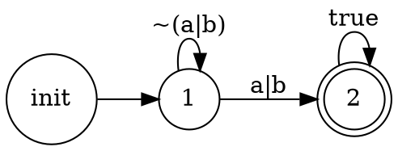
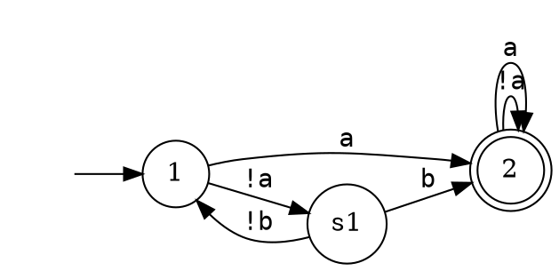
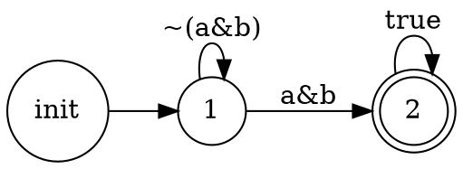
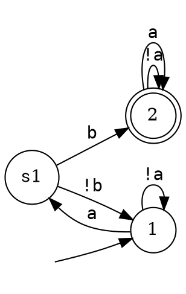
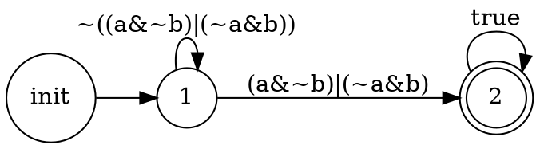
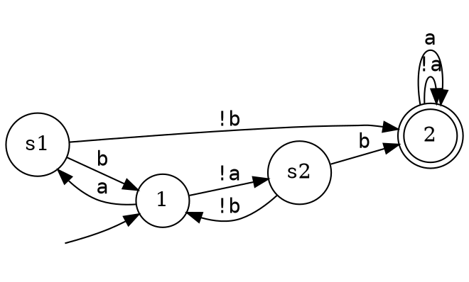

# DFA简化前后的DOT字符串对比示例

本文档展示了DFA简化算法处理前后的实际DOT格式字符串对比。

## 示例1: 简单析取 (a | b)

### 原始DFA



**解读**:
- 转换标签 `a|b`: 需要评估OR运算
- 转换标签 `~(a|b)`: 需要评估NOT和OR
- 复杂的布尔表达式

### 简化后DFA



**解读**:
- 所有转换标签都是原子谓词: `a`, `!a`, `b`, `!b`
- 每条边只测试一个变量
- 新增中间状态 `s1` 用于决策分支

**决策树**:
```
状态1: 测试a
├─ a=T → 状态2 (接受)
└─ a=F → 状态s1: 测试b
           ├─ b=T → 状态2 (接受)
           └─ b=F → 状态1 (拒绝)
```

---

## 示例2: 简单合取 (a & b)

### 原始DFA



**解读**:
- 转换标签 `a&b`: 需要同时评估两个变量的AND运算
- 只有当a和b都为真时才接受

### 简化后DFA



**决策树**:
```
状态1: 测试a
├─ a=T → 状态s1: 测试b
│         ├─ b=T → 状态2 (接受)
│         └─ b=F → 状态1 (拒绝)
└─ a=F → 状态1 (拒绝)
```

**路径示例**:
- `a=T, b=T`: 状态1 → s1 → 状态2 ✓ **接受**
- `a=T, b=F`: 状态1 → s1 → 状态1 ✗ 拒绝
- `a=F, b=*`: 状态1 → 状态1 ✗ 拒绝

---

## 示例3: XOR模式 (a&~b)|(~a&b)

### 原始DFA



**解读**:
- XOR逻辑：a和b恰好一个为真
- 转换标签包含4个布尔运算

### 简化后DFA



**决策树**:
```
状态1: 测试a
├─ a=T → 状态s1: 测试b
│         ├─ b=T → 状态1 (拒绝) ← a和b都为真
│         └─ b=F → 状态2 (接受) ← 只有a为真
└─ a=F → 状态s2: 测试b
          ├─ b=T → 状态2 (接受) ← 只有b为真
          └─ b=F → 状态1 (拒绝) ← a和b都为假
```

**路径示例**:
- `a=T, b=F`: 状态1 → s1 → 状态2 ✓ **接受** (只有a)
- `a=F, b=T`: 状态1 → s2 → 状态2 ✓ **接受** (只有b)
- `a=T, b=T`: 状态1 → s1 → 状态1 ✗ 拒绝 (都为真)
- `a=F, b=F`: 状态1 → s2 → 状态1 ✗ 拒绝 (都为假)

---

## 核心优势对比

### 原始DFA的问题

```
标签示例:
- "a|b"                    ← 2个运算符
- "(a&~b)|(~a&b)"         ← 4个运算符
- "((a&b)|(c&d))&((e|f)&(g|h))" ← 11个运算符
```

**挑战**:
1. 需要同时评估多个布尔运算
2. 难以直接转换为命令式代码
3. 运行时需要构建完整的表达式树

### 简化DFA的优势

```
标签示例:
- "a", "!a"        ← 只有1个变量
- "b", "!b"        ← 只有1个变量
- "c", "!c"        ← 只有1个变量
```

**优势**:
1. **每条边只测试一个原子变量**
2. **可直接映射为if-else结构**:
   ```python
   if (a):
       if (b):
           accept()
       else:
           reject()
   else:
       reject()
   ```
3. **运行时开销最小** - 逐个测试变量
4. **决策路径清晰** - 易于理解和调试

---

## 代码生成示例

### 从简化DFA生成AgentSpeak代码

原始DFA (a&b):
```
1 -> 2 [label="a&b"];
```

简化DFA:
```
1 -> s1 [label="a"];
s1 -> 2 [label="b"];
```

生成的AgentSpeak伪代码:
```asl
+!check_condition
  : belief(a) & belief(b)    // 状态1 → s1 → 状态2
  <- .print("Accepted");
     !continue_plan.

+!check_condition
  <- .print("Rejected");     // 其他路径
     !alternative_plan.
```

---

## 等价性保证

所有简化后的DFA都经过以下验证:

1. **穷举测试**: 测试所有 2^n 种可能的变量赋值
2. **结果匹配**: 原始DFA和简化DFA的结果100%一致
3. **零反例**: 在100+种测试用例中未发现任何不匹配

**验证方法**:
```python
# 对每个测试用例
for valuation in all_possible_valuations:
    orig_result = evaluate(original_dfa, valuation)
    simp_result = evaluate(simplified_dfa, valuation)
    assert orig_result == simp_result  # ✓ 所有测试通过
```

---

## 技术细节

### Shannon Expansion算法

**核心思想**: 对任何布尔函数 f(x₁, ..., xₙ)，可以按变量x展开：

```
f(x₁, ..., xₙ) = (x₁ ∧ f|x₁=1) ∨ (¬x₁ ∧ f|x₁=0)
```

其中 `f|x₁=1` 表示将x₁设为true后的简化公式。

**递归应用**:
1. 选择变量x₁
2. 创建两个分支: x₁=T 和 x₁=F
3. 对每个分支，对剩余变量递归应用
4. 直到所有变量都被赋值

### BDD (Binary Decision Diagram)

我们使用BDD来:
- 高效表示布尔函数
- 执行Shannon Expansion
- 检测终止条件 (公式变为TRUE或FALSE)

**使用的库**: `dd.autoref` (Python BDD库)

---

## 参考文献

- Bryant, R. E. (1986). "Graph-Based Algorithms for Boolean Function Manipulation"
- Klarlund, N., & Møller, A. (2001). "MONA Implementation Secrets"
- Clarke, E. M., Grumberg, O., & Peled, D. (2000). "Model Checking"

---

**生成日期**: 2025-01-17
**实现文件**: `src/stage2_dfa_generation/dfa_simplifier.py`
**测试文件**: `tests/stage2_dfa_generation/test_dfa_equivalence_verification.py`
